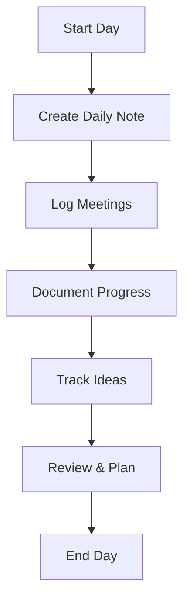
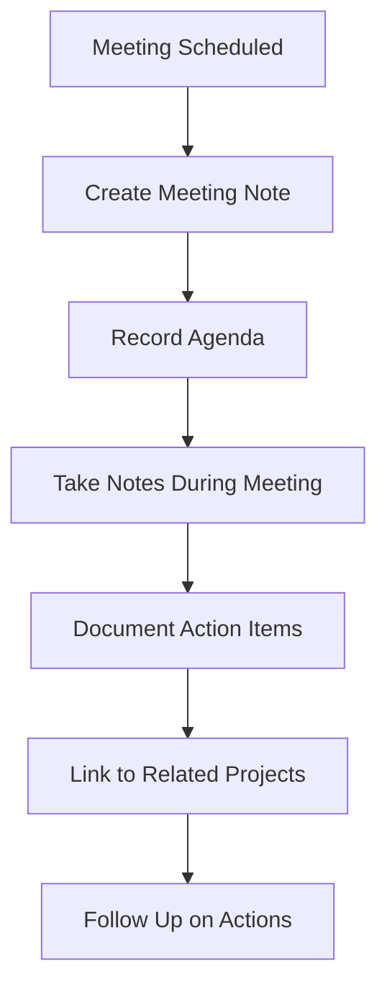
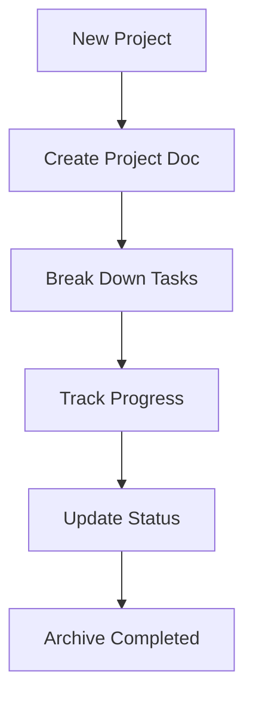

# Obsidian Documentation Workflow Guide

## Overview

This guide provides a comprehensive workflow for using Obsidian with Claude Code through the MCP integration, enabling powerful documentation management and knowledge retrieval capabilities.

## Quick Start Workflow

### 1. Daily Documentation Routine



**Steps:**
1. **Create daily note** using `obsidian-get-daily-note`
2. **Log meetings** throughout the day using `obsidian-create-from-template`
3. **Document progress** in daily and project notes
4. **Track ideas** as they come up
5. **Review and plan** for tomorrow

### 2. Meeting Documentation



**Using MCP Tools:**
```python
# Create meeting note from template
await obsidian_server.create_from_template(
    "Templates/Meeting Notes.md",
    "Meetings/Project Review 2025-01-15.md",
    {
        "meeting_title": "Project Review",
        "meeting_type": "review",
        "date": "2025-01-15",
        "start_time": "14:00",
        "end_time": "15:00"
    }
)
```

### 3. Project Management



**Project Setup:**
```python
# Create project documentation
await obsidian_server.create_from_template(
    "Templates/Project Documentation.md",
    "Projects/Lore Engine v2.md",
    {
        "project_name": "Lore Engine v2",
        "status": "planning",
        "priority": "high",
        "project_type": "game engine",
        "start_date": "2025-01-15",
        "target_date": "2025-06-30",
        "project_description": "Next generation game engine with advanced PCG capabilities"
    }
)
```

## Advanced Workflows

### 1. Research Management

**Research Process:**
1. **Literature Review**: Create research notes for papers/articles
2. **Synthesis**: Connect related research topics
3. **Application**: Link research to practical implementations
4. **Tracking**: Monitor research progress and insights

**Research Template Usage:**
```python
# Create research note
await obsidian_server.create_from_template(
    "Templates/Research Notes.md",
    "Research/Dungeon Generation Algorithms.md",
    {
        "research_topic": "Dungeon Generation Algorithms",
        "research_area": "procedural content generation",
        "priority": "high",
        "research_question": "What are the most effective algorithms for generating compelling dungeon layouts?"
    }
)
```

### 2. Knowledge Base Management

**Knowledge Organization:**
- **Tags**: Use consistent tagging system (#research, #implementation, #meeting)
- **Links**: Connect related concepts using `[[wiki links]]`
- **Folders**: Organize by type (Projects, Research, Meetings, Daily)
- **Templates**: Maintain consistency with structured templates

### 3. Cross-Reference System

**Linking Strategy:**
1. **Daily Notes** → Project updates
2. **Meeting Notes** → Action items → Project tasks
3. **Research Notes** → Implementation ideas → Project features
4. **Project Docs** → Related research, meetings, daily updates

## Template System

### Available Templates

1. **Daily Note** (`Templates/Daily Note.md`)
   - Daily goals and progress tracking
   - Meeting summaries
   - Ideas and reflections

2. **Meeting Notes** (`Templates/Meeting Notes.md`)
   - Structured meeting documentation
   - Action item tracking
   - Attendee and schedule management

3. **Project Documentation** (`Templates/Project Documentation.md`)
   - Comprehensive project tracking
   - Timeline and milestone management
   - Team and resource allocation

4. **Research Notes** (`Templates/Research Notes.md`)
   - Academic research documentation
   - Literature review structure
   - Findings and implications tracking

### Creating Custom Templates

**Template Structure:**
```markdown
---
title: "{{template_variable}}"
type: "template_type"
tags: [tag1, tag2]
created: "{{datetime}}"
---

# Template Content

Use {{variables}} for dynamic content:
- {{date}} - Current date
- {{time}} - Current time
- {{datetime}} - Date and time
- {{custom_var}} - Your custom variables
```

**Template Variables:**
- `{{date}}` - YYYY-MM-DD format
- `{{time}}` - HH:MM:SS format
- `{{datetime}}` - Full timestamp
- `{{weekday}}` - Day of week
- Custom variables passed in creation call

## MCP Tool Usage Examples

### 1. Basic File Operations

```python
# List all files in a directory
files = await obsidian_server.list_vault_files("Projects", recursive=True)

# Create a new note
success = await obsidian_server.create_note(
    "Projects/New Project.md",
    "# New Project\n\n## Overview\nProject description..."
)

# Get note content
content = await obsidian_server.get_note_content("Projects/Existing Project.md")

# Update existing note
success = await obsidian_server.update_note(
    "Projects/Existing Project.md",
    updated_content
)
```

### 2. Search and Discovery

```python
# Search for notes
results = await obsidian_server.search_notes("dungeon generation", context=5)

# Search by tag
tagged_notes = await obsidian_server.search_by_tag("pcg")

# Get backlinks for a note
backlinks = await obsidian_server.get_backlinks("Projects/Lore Engine.md")
```

### 3. Template-Based Creation

```python
# Create daily note
daily_note = await obsidian_server.get_daily_note("2025-01-15")

# Create meeting from template
success = await obsidian_server.create_from_template(
    "Templates/Meeting Notes.md",
    "Meetings/Team Standup 2025-01-15.md",
    {
        "meeting_title": "Daily Team Standup",
        "meeting_type": "standup",
        "date": "2025-01-15",
        "start_time": "09:00",
        "end_time": "09:15",
        "location": "Conference Room A"
    }
)
```

## Automation Scripts

### 1. Daily Note Creation

```python
# automated_daily_notes.py
import asyncio
from scripts.advanced_obsidian_mcp import AdvancedObsidianServer, ObsidianConfig

async def create_daily_note():
    config = ObsidianConfig(
        api_key="your-api-key",
        host="localhost",
        port=27123
    )

    async with AdvancedObsidianServer(config) as server:
        result = await server.get_daily_note()
        print(f"Daily note: {result['path']}")

if __name__ == "__main__":
    asyncio.run(create_daily_note())
```

### 2. Weekly Review Script

```python
# weekly_review.py
async def generate_weekly_review():
    """Generate weekly review from daily notes"""
    config = ObsidianConfig(api_key="your-api-key")

    async with AdvancedObsidianServer(config) as server:
        # Get all daily notes from this week
        daily_notes = await server.get_notes_by_folder("Daily")

        # Compile weekly summary
        summary = "# Weekly Review\n\n## Accomplishments\n\n## Challenges\n\n## Next Week\n"

        # Create weekly review note
        await server.create_note(
            f"Weekly/Week {get_week_number()}.md",
            summary
        )
```

## Best Practices

### 1. Consistent Structure
- Use templates for consistent documentation
- Maintain clear naming conventions
- Follow established folder structure

### 2. Regular Maintenance
- Review and update documentation regularly
- Archive completed projects
- Clean up unused tags and links

### 3. Cross-Referencing
- Link related concepts using wiki links
- Use tags for categorization
- Maintain backlink awareness

### 4. Quality Assurance
- Review generated content for accuracy
- Validate links and references
- Ensure proper template usage

## Integration with Development Workflow

### 1. Git Integration
- Commit documentation changes regularly
- Use `.gitignore` for sensitive data
- Maintain documentation alongside code

### 2. Task Management Integration
- Link project notes to task management tools
- Track progress across systems
- Maintain consistent status updates

### 3. Collaboration Features
- Share relevant notes with team members
- Use standardized templates for team consistency
- Maintain clear ownership and responsibilities

## Troubleshooting

### Common Issues

1. **API Connection Issues**
   - Verify Obsidian is running
   - Check Local REST API plugin status
   - Confirm API key validity

2. **Template Not Found**
   - Verify template paths are correct
   - Check template file permissions
   - Ensure template syntax is valid

3. **Search Not Working**
   - Check search query format
   - Verify content indexing in Obsidian
   - Ensure proper content structure

### Debug Tips

1. **Enable Debug Logging**
   ```bash
   export OBSIDIAN_DEBUG=1
   ```

2. **Test API Connection**
   ```bash
   curl -H "Authorization: Bearer your-key" http://localhost:27123/vault/
   ```

3. **Check Cache Issues**
   - Clear cache if data is stale
   - Verify cache configuration
   - Monitor cache performance

## Future Enhancements

### Planned Features
1. **Advanced Search**: Fuzzy matching and semantic search
2. **Graph Integration**: Visual knowledge graph navigation
3. **Automated Summaries**: AI-powered content summarization
4. **Mobile Sync**: Cross-platform access capabilities
5. **Collaboration**: Real-time collaborative editing

### Integration Opportunities
1. **Task Management**: Direct integration with task systems
2. **Calendar Integration**: Automatic meeting scheduling
3. **AI Assistance**: Smart content suggestions
4. **Version Control**: Enhanced git integration
5. **Export Capabilities**: Multiple format export options

---

This workflow guide provides a comprehensive foundation for effective documentation management using Obsidian and Claude Code. The system is designed to be flexible, scalable, and adaptable to various documentation needs and workflows.